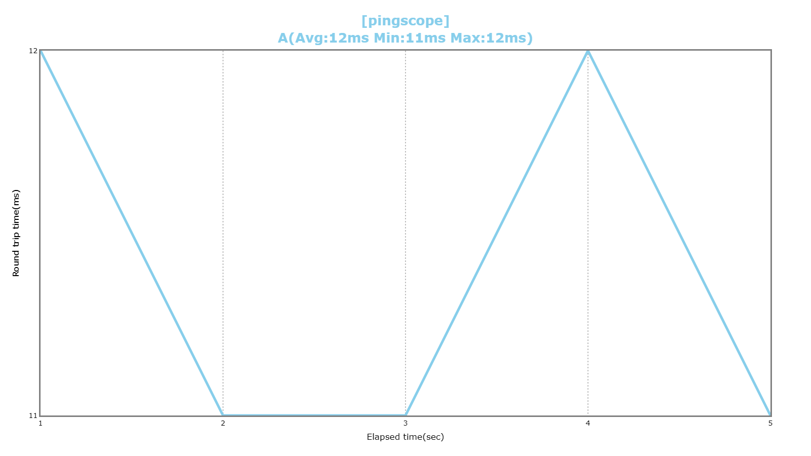

# pingscope
Measuring and graphing ping

## Concept
Returns the ping result as an integer value in milliseconds and outputs an image

### Ping result
```
#{"Dst": "www.google.com", "Count": 5}
12
11
11
12
11
#{"Avg": 12, "Min": 11, "Max": 12, "ElapsedTime": 5.056681200047024}
```

### PDF(PNG)


## What is ping
### Purpose
- Confirm communication with communication partner and measure response speed

### Command
`ping www.google.com -n 5`

### Result
```
www.google.com [x.x.x.x]に ping を送信しています 32 バイトのデータ:
x.x.x.x からの応答: バイト数 =32 時間 =10ms TTL=119
x.x.x.x からの応答: バイト数 =32 時間 =11ms TTL=119
x.x.x.x からの応答: バイト数 =32 時間 =11ms TTL=119
x.x.x.x からの応答: バイト数 =32 時間 =13ms TTL=119
x.x.x.x からの応答: バイト数 =32 時間 =13ms TTL=119

x.x.x.x の ping 統計:
    パケット数: 送信 = 5、受信 = 5、損失 = 0 (0% の損失)、
ラウンド トリップの概算時間 (ミリ秒):
    最小 = 10ms、最大 = 13ms、平均 = 11ms
```

## What is possible
1. Returns the ping execution result as an integer value in milliseconds
2. Output ping results as images

## Reason for development
- I would like to obtain the round trip time (hereinafter referred to as __RTT__), which is the ping result, as an integer value in milliseconds to make it easier to process
- I want to output RTT as an image so that I can understand it at a glance
- I want to express the stability of RTT using color

## RTT tiers
|Rank|Range|Color image|Color name|Color code|
|:-:|:-:|:-:|:-:|:-:|
|S|0 - 9ms||Blue|#0000FF|
|A|10 - 14ms||Skyblue|#87CEEB|
|B|15 - 19ms||Green|#00FF00|
|C|20 - 29ms||Yellow|#FFFF00|
|D|30 - 49ms||Orange|#FFA500|
|E|50ms over||Red|#FF0000|

## Versions

|Version|Summary|
|:--|:--|
|0.1.0|Release pingscope|

## Installation
### [pingscope](https://pypi.org/project/pingscope/)
`pip install pingscope`

## Usage
```python
import pingscope as ps

ps.Pingscope().save("./google.ping", "www.google.com").to_figure_helper().write_image("./google.png")
```
